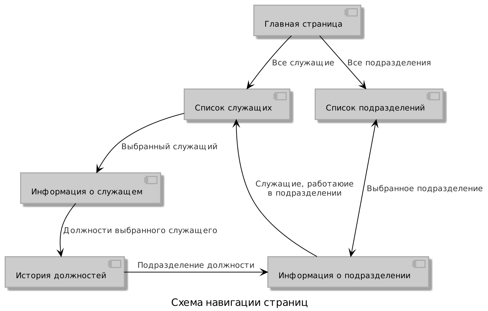
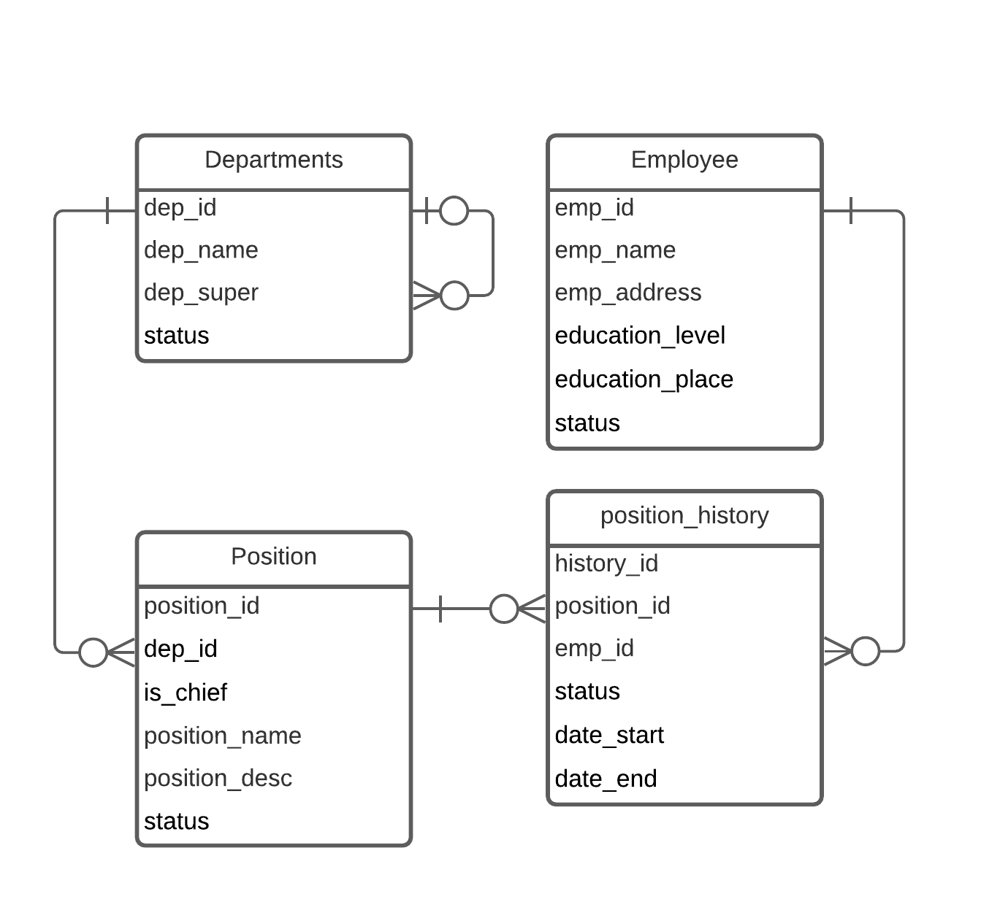

Web-application CMC MSU
=======================
Описание страниц
-----------------------

Дополнительно с любой страницы можно вернуться на главную или перейти на список всех
служащих или подразделений через быстрое меню.

### Главная страница
1. Красивая шапка
2. Ссылка на список всех служащих
3. Ссылка на список всех подразделений
4. Ссылка на список должностей
### Список служащих
1. Кнопока "Добавить служащего" (отправляет на страницу информации о служащем в режиме создания
нового служащего (все поля пустые, служащий не создаётся в БД до сохранения))
2. Фильтр поиска по служащим (фильтр по имени, фильтр по подразделению и т.д.)
3. Режим сортировки
4. Список служащих (отображается имя и некоторые другие параметры, например текущаю должность)
### Список подразделений
1. Кнопка "Добавить подразделение" (отправляет на страницу информации о подразделении в режиме
создания нового подразделения, аналогично таковому для служащих)
2. Фильтр поиска по подразделениям (фильтр по названию, фильтр по руководителю и т.д.)
3. Режим сортировки (по названию, по руководителю, иерархия)
4. Список подразделений (отображается имя и руководитель, в режиме иерархии отображается в виде 
многоуровневого списка.
### Информация о служащем
1. ФИО (редактируемое)
2. Домашний адрес (редактируемое)
3. Образование (редактируемое)
4. Срок работы в компании (не редактируется, вычисляется по суммарному времени занимаемых
 должностей)
5. История занимаемых должностей (короткий список со ссылкой на страницу "История должностей")
### История должностей
1. Имя сотрудника
2. Подробный список истории занимаемых должностей (с названиями подразделений, сроками и т.д.)
3. Форма для смены должности (позволяет назначить на незанятую должность)
4. Форма для снятия с должности
### Информация о подразделении
1. Название (редактируемое)
2. Руководитель (редактируемое, соответствует должности руководитель, но не отображается в списке должностей)
3. Должности (редактируемый список должностей и позиций с возможностью открывать, закрывать (если
 в должности никто не состоит) и менять кол-во позиций, ссылка на список служащих с 
 соответствующим фильтром)
4. Головное подразделение (с возмостью сменить головное подразделение или назначить подразделением
 верхнего уровня)
5. Внутренние подразделения (ссылка на на список подразделений с соответствующим фильтром)

Схема базы данных
-----------------

Сценарии использования
----------------------
- Найти всех сотрудников по подразделению (должности, сроку работы)
    - Перейти на главную страницу
    - Перейти на страницу списка сотрудников
    - Выбрать фильтр подразделния (подраделния затем должности, минимального/маскимального срока 
работы)
    - Ввести название подразделения (подразделния и должности в нём, сроки работы)
- Найти все подразделения в которых работал сотрудник
    - Перейти на главную страницу
    - Перейти на страницу списка сотрудников
    - Выбрать фильтр имени
    - Ввести имя сотрудника
    - Перейти на страницу сотрудника
    - Перейти на страницу подродбной истории занимаемых должностей
- Получение структуры подразденений
    - Перейти на главную страницу
    - Перейти на страницу списка подразделений
    - Выбрать режим сортировки "Иерархия"
- Назначение служащего на новую должность
    - Как описано выше перейти на страницу нужного подразделения
    - Через форму создания должности создать новую должность
    - Как описано выше перейти на страницу нужного сслужащего
    - Перейти в список занимаемых должностей
    - Через форму назначить на созданую должность
